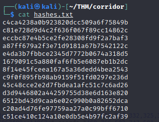
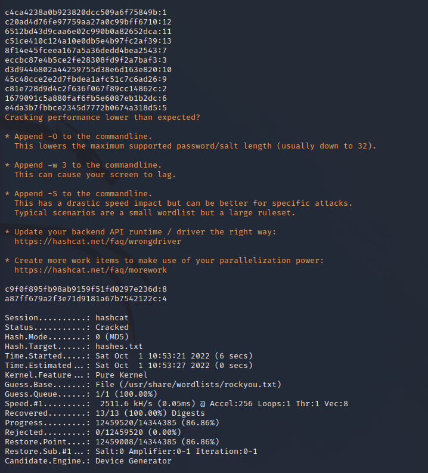
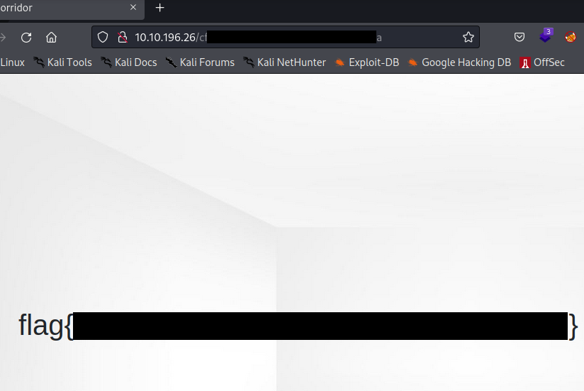

# THM - Corridor

## 0. Setup

Room link: [https://tryhackme.com/room/corridor](https://tryhackme.com/room/corridor)

**Read the room description**\
You have found yourself in a strange corridor. Can you find your way back to where you came?\
In this challenge, you will explore potential IDOR vulnerabilities. Examine the URL endpoints you access as you navigate the website and note the hexadecimal values you find (they look an awful lot like a _hash_, don't they?). This could help you uncover website locations you were not expected to access.

**Room Tasks & Objectives**\
Use IDOR to reach a flag.\
(If you are unfamiliar with IDOR I recommend reading through [this post on infosecwriteups](https://infosecwriteups.com/what-is-idor-vulnerability-and-how-does-it-affect-you-85431d10f8fb))

**Optional setup:**\
I like to save the target IP as a variable called TGT which can be used in commands and save having to type it out each time. Also makes copying commands from my notes a lot easier


## 1. Recon & Enumeration

### 1.1 nmap

```bash
sudo nmap -sV -T4 -p- $TGT
```

Options explained: -sV runs version detection, -T4 is the timing template to use (0: slowest, 5: quickest), -p- scan all ports

**nmap results:**

<figure><figcaption></figcaption></figure>

Points of interest from nmap results:\
\- Port 80 open hosting [Werkzeug](https://pypi.org/project/Werkzeug/)

### 1.2 View Website

We can navigate to the website in browser using the target IP `http://<TGTIP>`

From here I generally browse the website as a user would do (alongside viewing page sources) to get an idea of the websites functionality and purpose before using enumeration tools.

.png>)

We are presented with an image of a room with doors that we can click on to take us to another page showing us an image "/static/img/empty\_room.jpg"


**Main page source**\
As the image takes up the whole browser window it's hard to use the usual method I use to view source with right click -> view source. Instead you can either use `Ctrl + U` or type into the address bar `view-source:http://<TGTIP>`. Note: I have only tried this on Windows with Chrome and Firefox.

<figure><figcaption></figcaption></figure>

From viewing the main page source we can see, with the help of the room description "they look an awful lot like a _hash_" we have a list of hashes in the link references. These references are used with the doors on the main page.

<figure><figcaption></figcaption></figure>

**Do all the links take us to the same empty room?**\
There are only 13 links to check which wouldn't take to long manually but instead I gathered the unique part of each link and put them in a document "hashes.txt"



Then I used [Wfuzz](https://wfuzz.readthedocs.io/en/latest/) to see if any of the rooms were unique

```bash
wfuzz -z hashes.txt http://$TGT/FUZZ
```

<figure><figcaption></figcaption></figure>

So all doors take us to the same empty room we looked at earlier.

Putting one of the examples (I chose "c4ca4238a0b923820dcc509a6f75849b") into a hash identifier like [https://hashes.com/en/tools/hash\_identifier](https://hashes.com/en/tools/hash\_identifier) it tells us we possibly are looking at an MD5 hash.

<figure><figcaption></figcaption></figure>

**Crack the hashes with hashcat**\
Using my document "hashes.txt" I made earlier I used hashcat to crack them using the [rockyou word list](https://www.kali.org/tools/wordlists/)

```
hashcat -m 0 hashes.txt /usr/share/wordlists/rockyou.txt 
```

<figure><figcaption></figcaption></figure>

So it appears that the links on the web page are just MD5 hashes of the numbers 1 - 13.

## 2. Exploitation

Looking to exploit the the pattern used by the room links we can try different numbers and see if that takes us anywhere else on the website.

My initial thought was to try the numbers 13 - 100 (13 being a working link we can use as a reference later). This was a two step process for me:

* Get a list of the MD5 hashes of numbers 13 to 100
* Use this list to check for access to a new page

**Getting our hashes with Python**\
I used the Python script below to create a file "hashList.txt" containing our MD5 hashes

```python
import hashlib #Used for creating MD5 hash

hash_list=[] #This will hold the hashes until we output them to a file

#For each number i get the MD5 hash and append it to hash_list
for i in range(13,101):
	result = hashlib.md5(str(i).encode('utf-8')).hexdigest()
	hash_list.append(result)

#Output our hash results to a new document
with open('hashList.txt', 'w') as f:
    for line in hash_list:
        f.write(f"{line}\n")
```

We can check it ran correctly comparing our first hashList.txt result for 13 to our legitimate links list, as well as using [wordcount](https://linux.die.net/man/1/wc) to make sure we have the number of expected results


**Use wfuzz to check for a new page**\
Similar to how wfuzz was used earlier the following command uses our "hashList.txt" file

```bash
wfuzz -w hashList.txt http://$TGT/FUZZ
```

<figure><figcaption></figcaption></figure>

All our new MD5 hashes result in a 404 (page not found) response. So no luck here. I could try increase the range of MD5 hashes but first I thought I would try go negative (and zero)

**Trying a different number range**

Strictly one line needs to change from the last script:

```python
# Use third argument to change increment amount to -1
ints = range(0,-100, -1)
```

But I also changed the output name so I could keep the last list created as well.

```
#Output our hash results to a new document
with open('hashListNeg.txt', 'w') as f:
```

Putting this into the wfuzz command again:

```
wfuzz -w hashListNeg.txt http://$TGT/FUZZ 
```

<figure><figcaption></figcaption></figure>

**SUCCESS!** We get a single valid response for the MD5 hash of 0. In hindsight I could easily have tried this manually without the python script!

Browsing to this new page we are shown the flag value for the room

<figure><figcaption></figcaption></figure>

Thanks for reading my writeup of the Corridor room.

## TLDR

* Scan machine and discover website
* Take note that links are MD5 hashes
* Crack hashes to see links are hashes of the numbers 1 - 13
* Try different numbers and get access to flag page using 0
